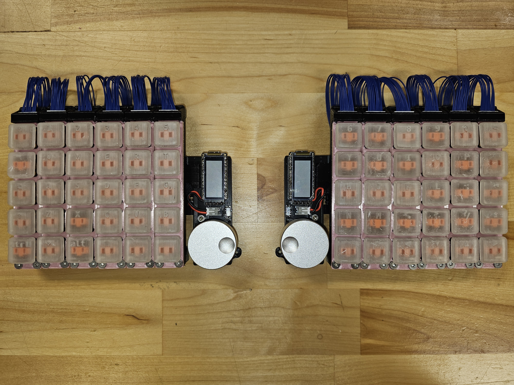
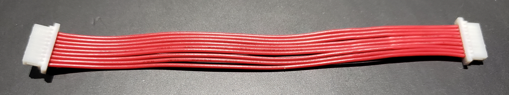

# Seismos

An evolution of the Zebra keyboard, but can be used for everyday typing. Switch between ortholinear for macro keypads and staggered for typing on the go.

Since this design utilizes daughter boards, you can even choose to move the columns around with a different rail system from the example one provided.

Allows for an interchangeable configuration between 4 and 5 row keys per column. With both halves of the keyboard, you can have a maximum of 68 keys (+2 encoder switches).

**NOTE:** If you had downloaded gerber files before December 5th, 2023, ***redownload*** the files as the RGB lights were not wired correctly. Apparently KiCAD displays the back side from the top perspective... doh! This is fixed. I also fixed the power switch so that sliding it up turns on the keyboard rather than this not being congruent on both sides.

## Pictures / Example Column Shifts:
<div style="display: flex; justify-content: center;">
    <figure>
        
    </figure>
    <figure>
        
    </figure>
    <figure>
        
    </figure>
</div>

# PCB Library Structure

NOTE: If you check the PCB for DRC errors, most of them will come from either the keyboard_reversible.pretty footprint or the switch footprints inherited from the MiRage keyboard. Since both have been used before, they can be ignored.

## Libraries
All PCBs in the `pcbs` folder refer to the footprint and symbol libraries found in `libs/Seismos-libs` as well as `libs/keyboard_reversible.pretty`.

Wait, keyboard_reversible.pretty isn't in the git clone? You need to run git submodule initialization and update with this command:
```bash
git submodule update --init --recursive
```

After this, you should not get errors on missing libraries.

## Current State of PCBs
Since release v2.0.0, there are now PCBs that incorporate the 74HC595A shift register. Thanks to drFaustroll (from QMK Discord) on an example schematic for the shift register. With this shift register, displays are now on their own I2C / SPI bus and two pins are dedicated to split communications. 2 pins are now free so I have openned up these pins at the bottom of the keyboard on the front side. These ARE NOT compatible with the I2C variants of the keyboards unless you are not using the displays and will need some modification of the firmware, so choose carefully!

***WARNING***: If you are planning to use a display on this keyboard, note that nice!view compatibility with the I2C PCBs only applies for wireless builds only! Annoyingly, the nice!view does not use an ***I2C*** interface; it uses an ***SPI*** interface to work (***whyyyyyyy***). I considered moving the CS pin to the headphone jack, but this means that one of the hardware pins for I2C is not connected so this did not happen. Normal 4 pin I2C SSD1306 displays will work for wired or wireless builds however assuming that all communications happen on I2C.

There are column and thumb cluster layouts for 4 and 5 keys (however, thumb cluster can only have 4 max). This means you can get a max total of 68 keys, plus two if you are using the rotary encoders as buttons.

For this release, there are PCBs for 4 and 5 columns. Currently, the left, right, and columns are made with a maximum size of 7x5 keys per side. Something to know is that due to routing efficiency, the column order is reversed for the right side; however, row number remains the same from top to bottom.

With release v1.1.2, the PCBs are now fully tested and ready to be used. Still, read through the notes for building this keyboard a couple sections below so you know what you're getting into.

## PCB Design Thoughts
Theoretically, since JST SH connectors are pretty small, we can possibly a maximum of 12 pins, which means that you can get at most ~7 rows per column... if the microcontroller has that many pins!

Some future design thoughts:
* A suggestion to reduce pin count is to wire the 1x4 keys as a 2x2 key setup to save pins; however, this results in a 2x2n keyboard layout, which will likely be a pain... Still interesting though to point out.
* ZMK has a pull request that introduced charlieplexing, which will reduce the pin count. If this is done per half, it may be possible to have a 70% keyboard on both sides with 10 rows per column (5 forward diodes, 5 backwards diodes). There's quite a lot of room here but currently it is still in development.

# Important notes for building keyboard

For the JST SH cables, note that the male to male connector tips should face the same side. An example one is shown below (note it is a 9 pin JST SH cale, but should be the same for 10 pin JST cables).

Example of JST SH cable with male-to-male connectors facing the same side.
<div style="display: flex; justify-content: center;">
    <figure>
        
    </figure>
</div>

Soldering the JST SH connectors is not easy! It is recommended to use the stencil design that is provided along with the stencil jig, hot plate, and solder paste. Otherwise, use a soldering iron and rely on flux!

After you are done building the core and mantle PCBs, there are example firmware files provided. Please checkout the `firmware_example` folder for more details. (Unfortunately, I haven't gotten to QMK yet, so that will have to wait for a bit)

# Required PCBs to upload

For PCBs, you will need the following:
* Minimum 2 core PCBs for left and right hands
* At least 14 mantle PCBs, 7 per core PCB
    * To save on cost, you may want to just stick with 20 of one type of mantle. 5 or 4 rows are usually enough

### **NOTE:** For the Core PCBs, you wil need to choose if you want I2C only or with a shift register starting from release v2.0.0. If you want to minimize components needed **and you are sure that you have an ATMEGA microcontroller**, you should choose I2C only. If you are not sure, you should choose I2C with shift register and just get the 74HC595A.

# BOM
## Required
* (**If using shift register version**) 2x 74HC595A SOIC-16 shift registers, though you may want extras just in case
* 28 x 10 position JST SH individual wires and connectors (preferrably 10cm long). Aliexpress has these with different colors like cable mods.
    * NOTE: For these links, they come from the same seller. Contact the seller after placing a temporary order to reduce shipping costs before paying!
    * Wires: https://www.aliexpress.us/item/3256802676433370.html (choose colors, **10 cm**, and **double head**)
        * For 5 rows, 10 cm is typically enough; you may be surprised at how far the columns can go with this. However, if you plan on changing the case design, you may need 15 cm if your columns need to go farther.
    * Connectors: https://www.aliexpress.us/item/3256802084257935.html (choose **10 pin** and **SMD Horizontal**)
* Parts that can be found from Typeractive.xyz:
    * 2 x EVQPUC02K reset button
    * 2 x SSSS811101 (alternatively on Aliexpress, MSK-12C01 or SW-12C01N-GY18)
    * 2 x 110 mAH battery (since TRRS does not have 5V, you need batteries; may change later)
* 2 x nice!nano (or Arduino Pro Micro compatible footprint)
* 56-70 x 1N4148W Diodes (variable number depending on how many keys you want)
* M3 assorted length screws (see case section for more details)
* 56-70 x MX / Choc PCB Sockets (1511 for MX or 1350 for Chocs)

## Optional
* 56-68 x SK6812MINI-E for RGB
    * 6 x per column from center of keyboard + 4 for each thumb cluster
        * Example: left and right sides require 80 total for all columns. If you only need 5 columns, then you need 68.
* 2 x nice!view (or OLED, but won't be aligned to center of microcontroller)
* 4 x 12 pin low profile socket pin headers for socketed microcontrollers (or similar)
* 2 x Rotary encoder EC11 (similar to Sofle)
* 2 x PJ320A headphone jacks 
    * **NOTE**: Due to me wanting to allow for wireless or wired setups, **the current PCB design will not charge the other keyboard side**. This is because VCC is disconnected to avoid blowing up the charging circuit of the nice!nano. If you need it, bridge the connector near one of the headphone jack pins.
* 2 x 4.7k SMD resistors for I2C. This is only needed if you plan on using I2C for split communications. There's not enough space for THT versions so uh sorry :(.

# Case
Curious to see what it looks like? Behold, OnShape link that contains questionable features that are unlabelled... This case works with the PCBs and allows for sliding rails, but won't lock the rails. A better design is in the works, but this is a good start.

Currently, a better design is in the works to place the rails underneath the PCB instead of above; this would allow the keyboard to be more low profile. For now, this works.

**This design requires the following additional parts:**
* Countersunk M3 screws:
    * 24 M3x12mm
        * Mounts down the PCB to each column plate frame into the bottom stopper
    * 3 M3x8mm
        * Holds down the rails for the keyboard
    * 14 M3x6mm
        * Corresponding nuts for the top stopper screws located near the top of each column needed
    * 2 M3x5mm
        * For the holes near the encoder and display

<p align="center">
    <p>Onshape Document (click on picture):</p>
    <a href="https://cad.onshape.com/documents/f7367bff9cd2cc9be8d2436b/w/1f753fadbcf1b9049e256121/e/c4b472236e977df85b7d8a49">
        
    </a>
</p>

# More Pictures
<div style="display: flex; justify-content: center;">
    More pictures of build:
    <figure>
        
    </figure>
    <figure>
        
    </figure>
    Development case design:
    <figure>
        
    </figure>
    <figure>
        
    </figure>
</div>

# References

Seismos uses elements found from multiple places for footprints, symbols, and even the idea.

The idea for this keyboard was inspired from the [Zebra keyboard](https://github.com/nezumee/zebra). It uses jumper cables but looks to be mainly for having a physical means to determine the layout.

For footprints, they are derived from multiple places:
* [SnapEDA](https://snapeda.com) for initial 9 position JST SH footprints and models.
* [EasyEDA](https://easyeda.com) for the power switch, reset button, and 10 position JST SH footprints as well as some models.
* [Corne](https://github.com/foostan/crkbd) repository for the SK6812MINI-E footprint.
    * Fork from [petejohanson](https://github.com/petejohanson/crkbd/tree/board/corne-ultralight) for guide on nice!view pin connections.
* [Sofle](https://github.com/josefadamcik/SofleKeyboard) keyboard for rotary encoder and headphone jack footprints.
    * [Hayden Hu's PJ320A model](https://grabcad.com/library/pj320a-pj320d-3-5mm-jack-10) was used to show the headphone jack on the 3D viewer.
    * [Dmitry Levin's EC11 encoder models](https://grabcad.com/library/11mm-metal-shaft-rotary-encoders-tht-vertical-w-push-on-switch-1) was used to show the encoder on the 3D viewer.
* [keyboard_reversible.pretty](https://github.com/50an6xy06r6n/keyboard_reversible.pretty) for easy reverse footprints made for the Pro Micro.
* [Zack Freedman's MiRage Keyboard](https://github.com/ZackFreedman/MiRage) for Choc / MX footprints with modifications to include SK6812MINI-E within the footprint.
    * [Dennis Lee's Kailh 1350 socket model](https://grabcad.com/library/kailh-1350-socket-20) was used to show the switch socket on the 3D viewer.


In the libs folder, there may be other files regarding other footprints such as the EVQPUC02K. This was found on EasyEDA on early attempts to extract the footprints.
There is also the MSK-12C02 switch. This was found from [mzst's blog](https://mzstblog.blogspot.com/2016/01/msk-12c02-smd-slider-switch-spdt-eagle.html) website, which was a good reference for the switch, but I ended up using the symbol and combined with the other footprint found from EasyEDA. Archived here as well bvecause it is nice to have a backup of it.

For firmware, there are QMK, ZMK, and KMK. Only QMK has support for shift registers at the moment but I will get to the other firmwares at some point. QMK's firmware is somewhat based from the Sofle code already on the qmk_firmware, especially the oled implementation, which is untested. Also, the LICENSE may need to be updated; will check this later.
