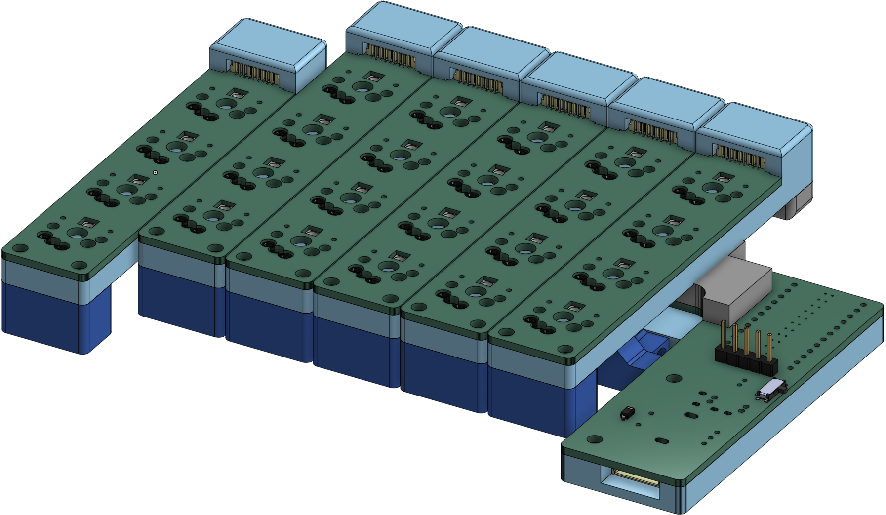

# Seismos

An evolution of the Zebra keyboard, but can be used for everyday typing. Switch between ortholinear for macro keypads and staggered for typing on the go.

Since this design utilizes daughter boards, you can even choose to move the columns around with a different rail system from the example one provided (stable case design coming soon).

## Pictures / Example Column Shifts:
<div style="display: flex; justify-content: center;">
    <figure style="text-align:center;">
        
        <figcaption>Ortholinear Setup</figcaption>
    </figure>
    <figure style="text-align:center;">
        
        <figcaption>Staggered Setup</figcaption>
    </figure>
    <figure style="text-align:center;">
        
        <figcaption>...or something completely different</figcaption>
    </figure>
</div>


# PCB Library Structure

NOTE: If you check the PCB for DRC errors, most of them will come from either the keyboard_reversible.pretty footprint or the switch footprints inherited from the MiRage keyboard. Since both have been used before, they can be ignored.

## Libraries
All PCBs in the `pcbs` folder refer to the footprint and symbol libraries found in `libs/Seismos-libs` as well as `libs/keyboard_reversible.pretty`.

Wait, keyboard_reversible.pretty isn't in the git clone? You need to run git submodule initialization and update with this command:
```bash
git submodule update --init --recursive
```

After this, you should not get errors on missing libraries.

## PCBs
For this release (as of 2023_10_15), there is only a release for 4 key columns. Theoretically, since JST SH connectors are pretty small, we can possibly get 10 or 11 pins, which means that you can get ~6 rows per column.

(NOTE: A suggestion to reduce pin count is to wire the 1x4 keys as a 2x2 key setup to save pins; however, this results in a 2x2n keyboard layout, which will likely be a pain... Still interesting though to point out.)

I have currently made the columns, left, and right part of the PCB. Currently, the PCB supports 6 columns. Something to know is that due to routing efficiency, the column order is reversed for the right side; however, row number remains the same from top to bottom.


# BOM
For this keyboard, you will need:

* JST SH individual wires and connectors (preferrably 10cm long). Aliexpress has these with different colors like cable mods.
    * Wires: https://www.aliexpress.us/item/3256802676433370.html (choose colors, 10cm, and double head)
    * Connectors: https://www.aliexpress.us/item/3256802084257935.html (choose 9 pin and SMD Horizontal)
* Parts that can be found from Typeractive.xyz:
    * EVQPUC02K
    * SSSS811101 (alternatively on Aliexpress, MSK-12C02 or SW-12C01N-GY18)
    * 110 mAH battery
* nice!nano (or Arduino Pro Micro compatible footprint)
* nice!view (or OLED, but won't be aligned to nice!nano)
* (Optional) SK6812MINI-E
* 1N4148W Diodes
* M3 assorted length screws (specific screw lengths to be added later)

# Case
Curious to see what it looks like? Behold, OnShape link that contains questionable features that are unlabelled... will get around to it but need a working prototype first!  
**WARNING: Case made but has not been test fitted with PCB!**  
<p align="center">
    <p>Onshape Document (click on picture):</p>
    <a href="https://cad.onshape.com/documents/f7367bff9cd2cc9be8d2436b/w/1f753fadbcf1b9049e256121/e/c4b472236e977df85b7d8a49">
        
    </a>
</p>


# References

Seismos uses elements found from multiple places for footprints, symbols, and even the idea.

The idea for this keyboard was inspired from the [Zebra keyboard](https://github.com/nezumee/zebra). It uses jumper cables but looks to be mainly for having a physical means to determine the layout.

For footprints, they are derived from multiple places:
* [SnapEDA](https://snapeda.com) for JST SH footprints and models.
* [EasyEDA](https://easyeda.com) for the power switch and reset button footprints.
* [Corne](https://github.com/foostan/crkbd) repository for the SK6812MINI-E footprint.
    * Fork from [petejohanson](https://github.com/petejohanson/crkbd/tree/board/corne-ultralight) for guide on nice!view pin connections.
* [Sofle](https://github.com/josefadamcik/SofleKeyboard) keyboard for rotary encoder footprints.
* [keyboard_reversible.pretty](https://github.com/50an6xy06r6n/keyboard_reversible.pretty) for easy reverse footprints made for the Pro Micro.
* [Zack Freedman's MiRage Keyboard](https://github.com/ZackFreedman/MiRage) for Choc / MX footprints with modifications to include SK6812MINI-E within the footprint.


In the libs folder, there may be other files regarding other footprints such as the EVQPUC02K. This was found on EasyEDA on early attempts to extract the footprints.
There is also the MSK-12C02 switch. This was found from [mzst's blog](https://mzstblog.blogspot.com/2016/01/msk-12c02-smd-slider-switch-spdt-eagle.html) website, which was a good reference for the switch, but I ended up using the symbol and combined with the other footprint found from EasyEDA. Archived here as well bvecause it is nice to have a backup of it.
